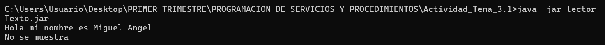
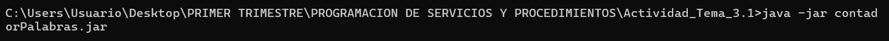
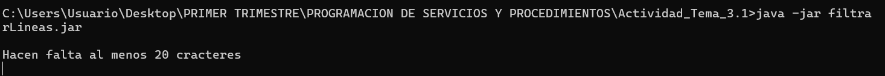

# 🎯 PSPA2T3

¡Hola! Bienvenido al proyecto **PSPA2T3** 😊  
Este repositorio contiene el desarrollo de la actividad correspondiente al tema 3 de PSP.

---

## 📂 Estructura del proyecto

Aquí tienes una vista general de la estructura de carpetas (según cómo esté organizado):

```
PSPA2T3/
├── lectorTexto/
│ ├── src/ ← Código fuente del lector de texto
│
├── contadorPalabras/
│ ├── src/ ← Código fuente del contador de palabras
│
├── filtrarLineas/
│ ├── src/ ← Código fuente del filtrador de líneas
│
└── README.md ← Este archivo principal
```

> 💡 Ajusta los nombres de carpetas si tu estructura es diferente.

---

## 🛠️ Instalación y uso

Sigue estos pasos para ejecutar o probar el proyecto:

1. Clona el repositorio  
   ```bash
   git clone https://github.com/MiguelAngelPerez21/PSPA2T3.git
   ```

2. Extrae la carpeta  Actividad_Tema_3.1 y ejecuta cmd en la ruta 
   ```bash
   cd /Actividad_Tema_3.1
   ```

3. Ejecuta la aplicación con java -jar  y concatena con |
   ```bash
   java -jar aplicacion.jar | java -jar ...
   ```

---

## 🎯 Objetivos del proyecto

- Implementar los enunciados del **Tema 3** de PSP.  
- Aplicar conceptos vistos en clase: concurrencia, sincronización, procesos/hilos, etc.  
- Realizar pruebas para validar el comportamiento esperado.  

---

## ✅ Funcionalidades

Aquí algunos puntos que deberían cumplirse (dependiendo del enunciado real):

- 🔄 Manejo de múltiples hilos / procesos  
- 🧵 Sincronización adecuada (monitores, semáforos, etc.)  
- 📩 Comunicación entre hilos / procesos  
- 📊 Casos de prueba y comprobaciones de resultados  

---

## 🧪 Manual de pruebas con tuberías

Además de ejecutarlos de forma independiente, se pueden encadenar con tuberías (|) para procesar la salida de un programa como la entrada del siguiente.

▶️ Ejecución independiente

Ejemplo con lectorTexto:
```
java -jar lectorTexto.jar 
```



Ejemplo con contadorPalabras:
```
java -jar contadorPalabras.jar 
```



Ejemplo con filtrarLineas:
```
java -jar filtrarLineas.jar 
```



▶️ Ejecución encadenada con tuberías

Podemos comprobar que las dos ultimas aplicaciones no funcionan correctamente de forma individual, pero podemos unirlas con tuberías para que cumplan su función:
```
java -jar lectorTexto.jar archivo.txt | java -jar filtrarLineas.jar | java -jar contadorPalabras.jar
```


---

## 📌 Notas importantes

- Asegúrate de que tu entorno de Java (versión) es compatible (por ejemplo, Java 8, 11 o más reciente).  
- Documenta tu código con comentarios claros.  
- Si el proyecto requiere configuración adicional (ficheros de entrada, parámetros, etc.), explícala aquí.

---

## ✍ Autores y créditos

- Desarrollado por **Miguel Ángel Pérez**  
- Basado en el enunciado del **Tema 3 de PSP**

---

## 🚀 Futuras mejoras

- Añadir un módulo gráfico (UI) si aplica  
- Mejorar manejo de errores  
- Más pruebas de estrés / concurrencia  
- Optimización de rendimiento  

---

¡Gracias por visitar!  
Si tienes dudas o quieres colaborar… ¡estaré encantado! 😊  
